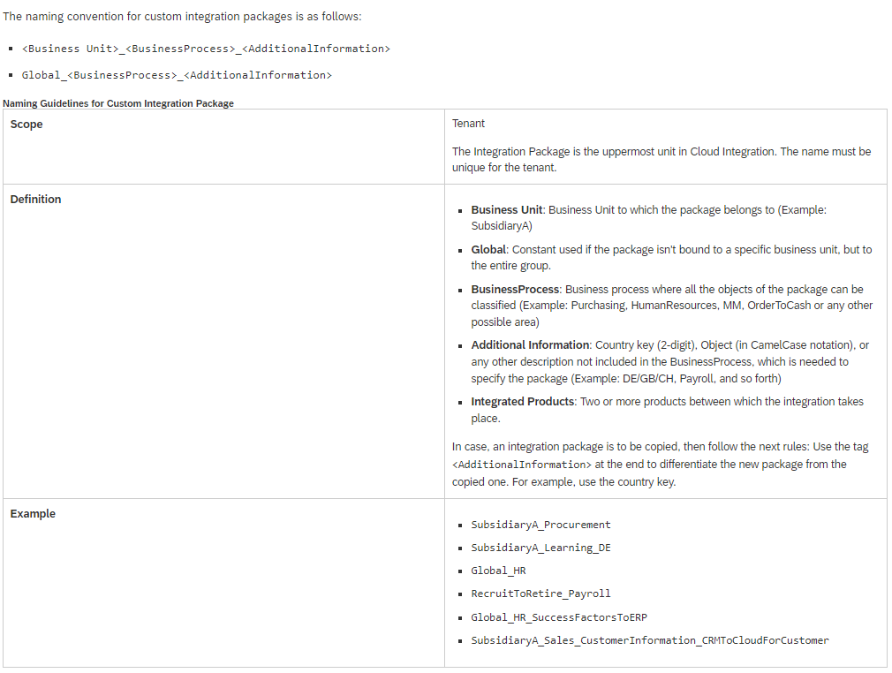

# SAP CPI - Naming Conventions

* [Integration Packages](#integrationPackage)
* [Integration Flow](#integrationFlow)
* [Boas Práticas para Desenvolvimento CPI](#integrationFlow)

## TLDR;

Abaixo segue as recomendações da SAP referente a nomenclatura CPI e consequentemente a diretriz da Atem.

É importante ter um sistema lógico por trás dos padrões de nomenclatura aplicados. Este sistema ajuda você a organizar e identificar rapidamente todos os inúmeros objetos relacionados em um ambiente de integração.
SAP CPI distingue a comunicação entre: 

- **Integration Package**: (pacote de organização do fluxo das integrações no CPI)

- **Integrarion Flow**: (lógica do processamento de mensagens no CPI)

## **Integration Package**

Um pacote de integração é usado como uma pasta para o conteúdo de integração (fluxos de integração, mapeamentos de valor e serviços OData).

Nomenclatura: `<Business Unit>_<BusinessProcess>_[<Sender/Receiver>_]<InterfaceDescription>`

#

### OData, SOAP, and Rest APIs

O Cloud Integration oferece suporte ao desenvolvimento de integração baseado em API, expondo fluxos de integração como serviços OData, SOAP ou RESTful.

#

_
<a href='#cpi'>ir para topo</a>
_

## Referências

- [Naming Conventions](https://help.sap.com/docs/cloud-integration/sap-cloud-integration/naming-conventions?locale=en-US)

