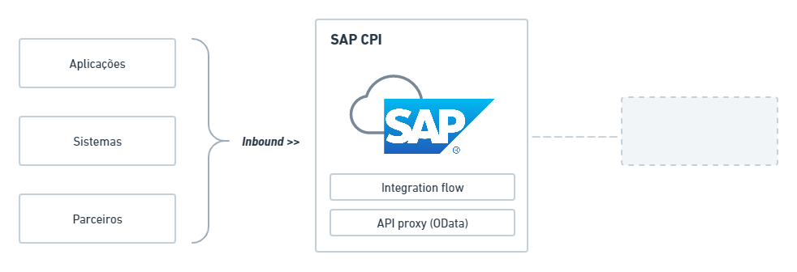
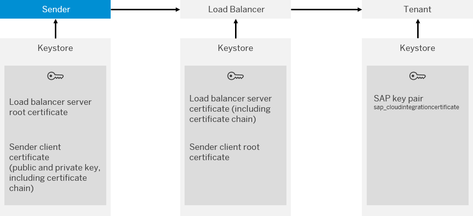
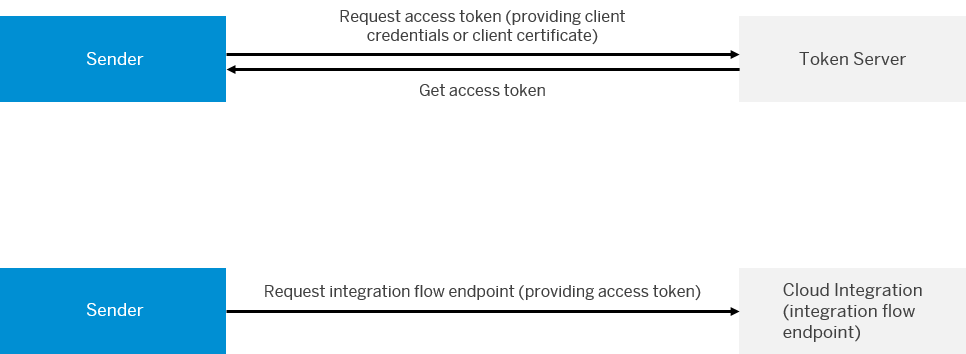
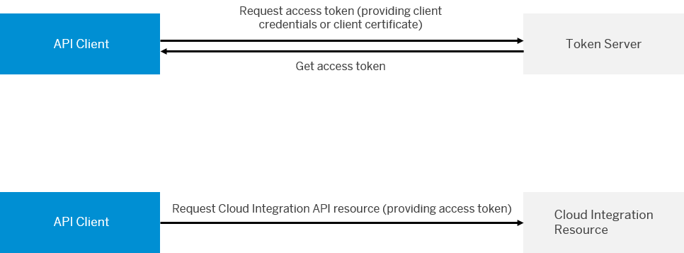
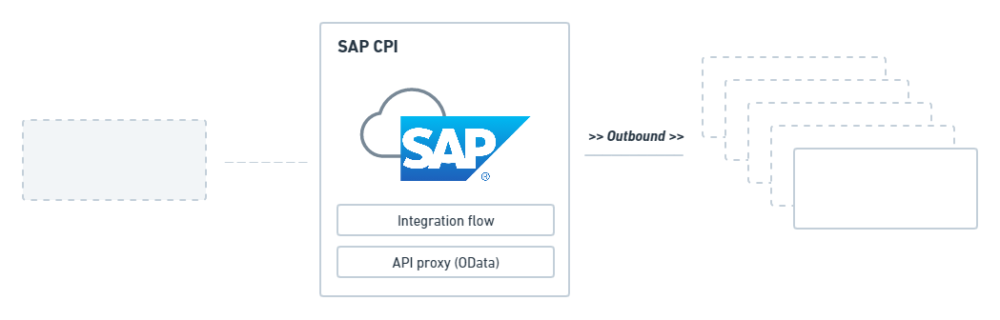

# SAP CPI - Opções de autenticação

* [Inbound](#inbound)
  - [Basic authentication](#)
* [Outbound](#outbound)
  - [Basic authentication](#)


## TLDR;

SAP CPI distingue a comunicação entre: 

- **Inbound**: (aplicações/sistemas/parceiros invocando o SAP CPI)

- **Outbound**: (SAP CPI invocando aplicações/sistemas/parceiros)


## **Inbound**

As opções de autenticação são suportadas:

- None
- Basic Authentication
- Client-certificate authentication
- OAuth Authentication com Client-Credentials (integrações - iFlow)
- OAuth Authentication com Client-Credentials (OData)



#

### Basic authentication

Permite a autenticação com o `sender` (CPI) através de credenciais _(username e password)_, sendo por meio de _IdP (Identity Provider)_ ou  _Service Instance_;

- [Documentação Oficial: Inbound Basic Authentication](https://help.sap.com/docs/CLOUD_INTEGRATION/368c481cd6954bdfa5d0435479fd4eaf/2c4c2d98e9de4b92a3b3af2ba9483909.html?locale=en-US)

**não recomendado em scenarios produtivos**.

#

_<p align="right"><a href='#cpi'>ir para topo</a></p>_


### Client-certificate authentication

> Permite que a autenticação seja feita com base em `client certificate`

CONFIGURAÇÃO ATUAL

> Durante tempo de execução, o sistema verifica se a `service key` é válida, posteriormente verifica se a `service instance` associada contém as roles necessárias. Sendo sucesso, a integração CPI (iFlow) é então invocada.

Resumidamente, para definir uma forma como o `sender` podem invocar integrações (iFlow), deve-se criar uma nova service-instance (service plan `integration-flow`), e então criar uma `service-key`, que permitirá o acesso do sender.

- [Documentação Oficial: Client Certificate Authentication (Inbound), Cloud Foundry Environment](https://help.sap.com/docs/CLOUD_INTEGRATION/368c481cd6954bdfa5d0435479fd4eaf/4ec61924d4464473a92eb3e78c8a0ae2.html?locale=en-US)

<p align="center">

</p>

#

_<p align="right"><a href='#cpi'>ir para topo</a></p>_


### OAuth Authentication com Client-Credentials (integrações - iFlow)

Permite o uso de `OAuth Client Credentials Grant Authentication` ao acessar integrações SAP CPI (`= iFlow`).

```text
direção 
INBOUND --> SAP CPI ...

eg.: 
... aplicações/sistemas/parceiros/ <----> SAP CPI (iFlow) <----> ... (outbound)
```

CONFIGURAÇÃO ATUAL

> Durante tempo de execução, é solicitado um token (via `client credentials` or `client certificate`), que é utilizado na(s) integração CPI (iFlow).

Resumidamente, para definir uma forma como `API Client` podem ser invocadas, deve-se criar uma nova service-instance (service plan `api`), e ajustar as permissões (`roles`) que autorizam o acesso a OData API.

- [Customização/Configuração de `OAuth Authentication com Client-Credentials para integrações (iFlow)` no SAP BTP](https://help.sap.com/docs/CLOUD_INTEGRATION/368c481cd6954bdfa5d0435479fd4eaf/6c052ce62b27449385d3e75aeeb08f05.html?locale=en-US)
- [Documentação Oficial: How It Works - Inbound Authentication for a Sender Calling an Integration Flow](https://help.sap.com/docs/CLOUD_INTEGRATION/368c481cd6954bdfa5d0435479fd4eaf/b9df72445c644c76b9ab76cad6015b5f.html?locale=en-US#how-it-works---inbound-authentication-for-a-sender-calling-an-integration-flow)

<p align="center">

</p>


#

_<p align="right"><a href='#cpi'>ir para topo</a></p>_


### OAuth Authentication com Client-Credentials (OData)

Permite o uso de `OAuth Client Credentials Grant Authentication` durante acesso direto a OData API utilizando SAP CPI API Client (`<> iFlow`).

```text
direção 
INBOUND --> SAP CPI ...

eg.: 
... aplicações/sistemas/parceiros/ <----> SAP CPI (API Client) <----> ... (outbound)
```

CONFIGURAÇÃO ATUAL

> Durante tempo de execução, é solicitado um token (via `client credentials` or `client certificate`), que é utilizado no acesso a API Client (OData).

- [Customização/Configuração de `OAuth Authentication com Client-Credentials para API Client` no SAP BTP](https://help.sap.com/docs/CLOUD_INTEGRATION/368c481cd6954bdfa5d0435479fd4eaf/20e26a837a8449c4b8b934b07f71cb76.html?locale=en-US),
- [Documentação Oficial: How It Works - Inbound Authentication for an API Client Calling the OData API](https://help.sap.com/docs/CLOUD_INTEGRATION/368c481cd6954bdfa5d0435479fd4eaf/b9df72445c644c76b9ab76cad6015b5f.html?locale=en-US#how-it-works---inbound-authentication-for-an-api-client-calling-the-odata-api)

<p align="center">

</p>

#

_<p align="right"><a href='#cpi'>ir para topo</a></p>_


<!-- 
### Certificate
 - Via _Service Instance_;
 - Via _Integration Flow_;

#

_<p align="right"><a href='#cpi'>ir para topo</a></p>_
-->

## Outbound

As opções de autenticação são suportadas (a lista é ordenada de baixa a alta segurança):

- None
- Basic Authentication
- Principal Propagation
- SASL (eg. AMQP)
- OAuth Authentication (eg.: token)
- Client Certificate Authentication
- Public Key Authentication



### Basic authentication

Permite a autenticação com o `receiver` através de credenciais _(username e password)_

- [Documentação Oficial: Outbound Basic Authentication](https://help.sap.com/docs/CLOUD_INTEGRATION/368c481cd6954bdfa5d0435479fd4eaf/a5d77b12ff16483c965cce936aa1b698.html?locale=en-US)

#

_<p align="right"><a href='#cpi'>ir para topo</a></p>_

## Referências

#### Inbound

- [Inbound Basic Authentication](https://help.sap.com/docs/CLOUD_INTEGRATION/368c481cd6954bdfa5d0435479fd4eaf/2c4c2d98e9de4b92a3b3af2ba9483909.html?locale=en-US)
- [Client Certificate Authentication (Inbound), Cloud Foundry Environment](https://help.sap.com/docs/CLOUD_INTEGRATION/368c481cd6954bdfa5d0435479fd4eaf/4ec61924d4464473a92eb3e78c8a0ae2.html?locale=en-US)
- [Customização/Configuração de `OAuth Authentication com Client-Credentials para integrações (iFlow)` no SAP BTP](https://help.sap.com/docs/CLOUD_INTEGRATION/368c481cd6954bdfa5d0435479fd4eaf/6c052ce62b27449385d3e75aeeb08f05.html?locale=en-US)
- [How It Works - Inbound Authentication for a Sender Calling an Integration Flow](https://help.sap.com/docs/CLOUD_INTEGRATION/368c481cd6954bdfa5d0435479fd4eaf/b9df72445c644c76b9ab76cad6015b5f.html?locale=en-US#how-it-works---inbound-authentication-for-a-sender-calling-an-integration-flow)
- [How It Works - Inbound Authentication for an API Client Calling the OData API](https://help.sap.com/docs/CLOUD_INTEGRATION/368c481cd6954bdfa5d0435479fd4eaf/b9df72445c644c76b9ab76cad6015b5f.html?locale=en-US#how-it-works---inbound-authentication-for-an-api-client-calling-the-odata-api)

#### Outbound 

- [Outbound Basic Authentication](https://help.sap.com/docs/CLOUD_INTEGRATION/368c481cd6954bdfa5d0435479fd4eaf/a5d77b12ff16483c965cce936aa1b698.html?locale=en-US)
- [Use Secure Authentication Methods](https://help.sap.com/docs/CLOUD_INTEGRATION/368c481cd6954bdfa5d0435479fd4eaf/3d46d45ab3b34581bebf9dddfafe47d5.html)