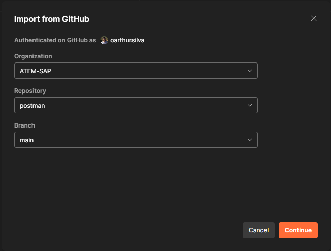
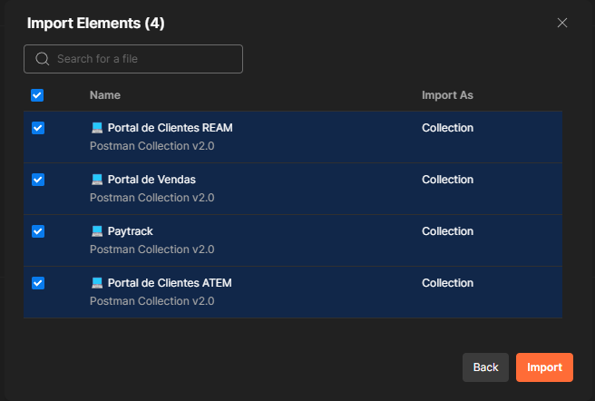
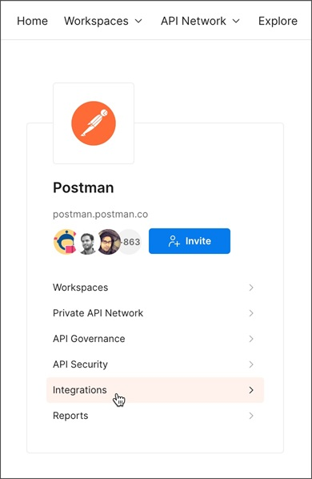
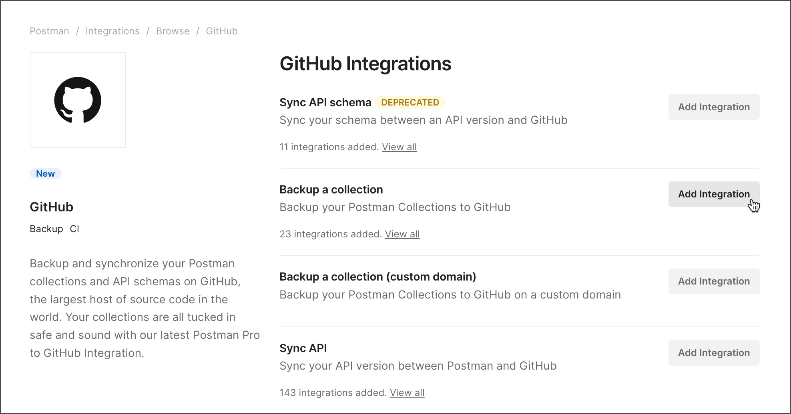
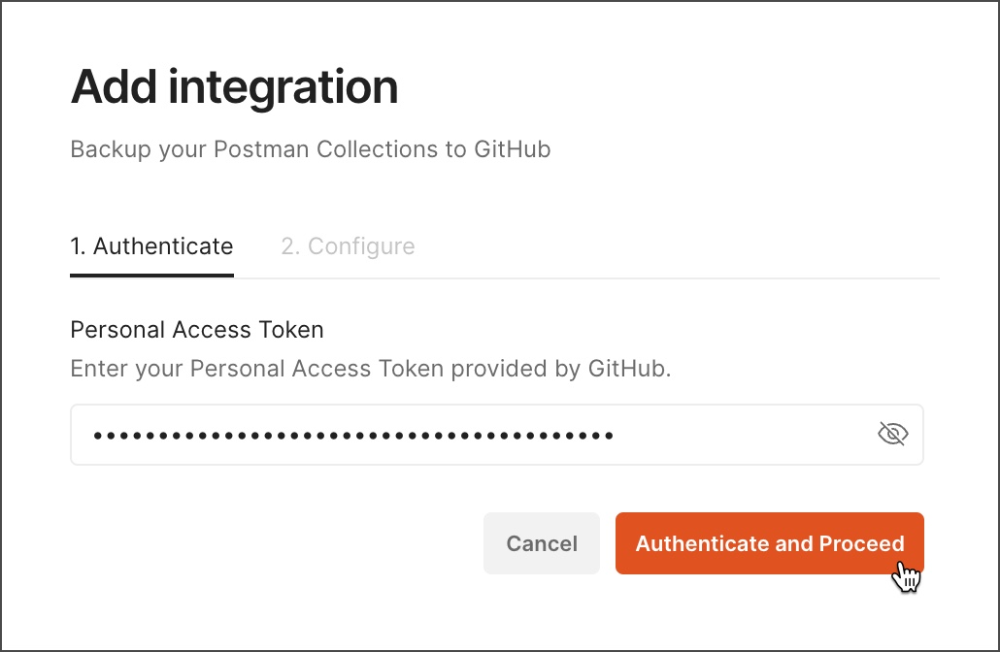
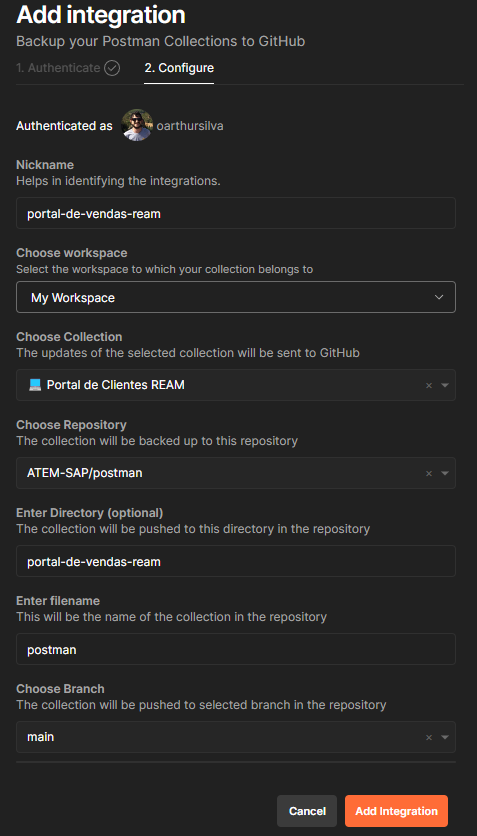

# Postman

> ℹ️ Este repositório tem como intuito realizar backups coleções do Postman no `GitHub`, através da ferramenta de integração `Postman - GitHub`.

- [Postman](#postman)
  - [Configuração](#configuração)
    - [Importar uma collection de um repositório do GitHub](#importar-uma-collection-de-um-repositório-do-github)
    - [Habilitar a integração automática](#habilitar-a-integração-automática)
  - [Gerando um token de acesso pessoal do GitHub](#gerando-um-token-de-acesso-pessoal-do-github)
  - [Referências](#referências)

## Configuração

### Importar uma collection de um repositório do GitHub

1) No Postman, selecione `Import` (Importar) na barra lateral.

2) No popup que se abrirá, selecione o tipo de repositório do qual você deseja importar; Clique em `Other Source` (Outras Fontes), e em seguida selecione GitHub.

3) Uma aba do navegador se abrirá pedindo para você entrar no seu repositório. Selecione a organização `ATEM-SAP` e siga as instruções na tela. Quando terminar, feche a aba do navegador e volte para o `Postman`.

4) De volta ao Postman, selecione a organização `ATEM-SAP`, repositório `postman` e a branch `main`, conforme a ilustração abaixo:

5) Finalmente, seleciona as collections que deseja importar.

### Habilitar a integração automática

> Para configurar uma integração com o GitHub, é necessário gerar um token de acesso pessoal do GitHub. **Saiba mais [aqui](#gerando-um-token-de-acesso-pessoal-do-github)**

Após configurar a integração, quaisquer novas alterações na coleção no Postman também aparecerão no repositório do GitHub automaticamente.

1) Na página inicial, selecione `Integrations` (Integrações).

2) Selecione a opção `GitHub`.

3) Ao lado de Fazer Backup de uma coleção, selecione `Adicionar Integração`.

4) Cole seu `Access Token` do GitHub, selecione `Autenticar` e `Proceder`.

5) Depois que o Postman verifica o token, você pode configurar a integração:

- **`Nickname` (Apelido)**
  - Dê um apelido à integração
- **Choose Workspace (Escolher workspace)**
  - Selecione o `workspace` que contém a collection que deseja integrar. Eg.: `My Workspace`
- **`Choose Collection` (Escolher collection)**
  - Selecione uma `collection`, Eg.: `💻 Portal de Vendas`
- **`Choose Repository` (Escolher repositório)**
  - Sempre informar `ATEM-SAP/postman`
- **`Enter Directory` (Entrar diretório)**
  - Digite o diretório, na estrutura do `GitHub`, onde as collections serão sincronizadas: Eg.: **(respeitar sempre essa norma!!!)**
    - `paytrack`
    - `portal-de-clientes-atem`
    - `portal-de-clientes-ream`
    - `portal-de-vendas`
- **Enter filename (Entrar nome do arquivo)**
  - Sempre informar `postman`

Para concluir a configuração da integração, selecione `Add Integration` (Adicionar Integração).

## Gerando um token de acesso pessoal do GitHub

Para integrar com o GitHub, você precisa de um token de acesso pessoal do GitHub, para isso:

1) Faça login no GitHub.

2) Acesse o menu `Settings` e selecione `Developer Settings`. Na tela que se abrirá, expanda a opção `Personal access token` e escolha `Fine-grained tokens`. Em seguida, clique no botão `Generate new token`:

- **Classic token** - Certifique-se de selecionar o `repo` e o `user`.

- **Fine-grained token** - Certifique-se de que o token tem acesso ao repositório para o qual você deseja fazer backup e possui as seguintes permissões de Repositório: `Contents (Read and write)` e `Metadata (Read-only)`.

3) Salve o token gerado para usar depois.

## Referências

- [Importar uma collection de um repositório do GitHub](https://learning.postman.com/docs/getting-started/importing-and-exporting/importing-from-git/)
- [Fazendo backup de collections no GitHub](https://learning.postman.com/docs/integrations/available-integrations/github/#backing-up-collections-to-github)
- [Gerando um token de acesso pessoal no GitHub](https://learning.postman.com/docs/integrations/available-integrations/github/#generating-a-github-personal-access-token)