# Como criar proxy `XI`

- Protocolo: `XI`
- Tipo de comunicação: `Sincrono`

## Visão geral

Os passos seguintes descrevem o processo de criação do proxy, tomando como base em um namespace previamente já estabelecido.

## Índice

- [Como criar proxy `XI`](#como-criar-proxy-xi)
  - [Visão geral](#visão-geral)
  - [Índice](#índice)
    - [Service Interface](#service-interface)
    - [Message Type Request](#message-type-request)
    - [Message Type Response](#message-type-response)

### Service Interface

- "Object Type"
  - `Service Consumer` (Service Interface)

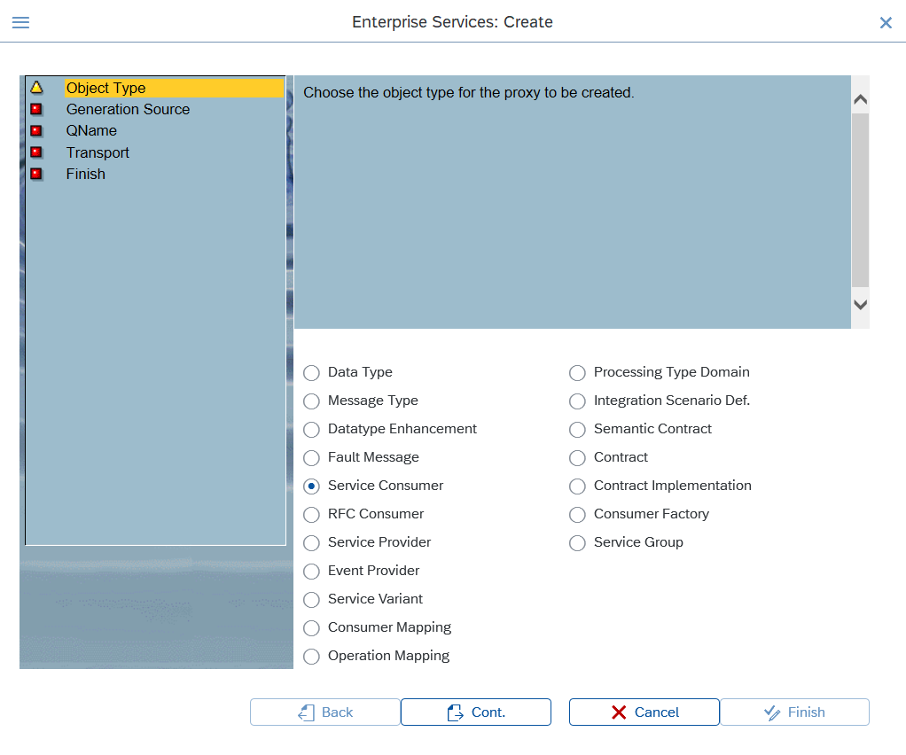

- "Generation Source"
  - `Backend`

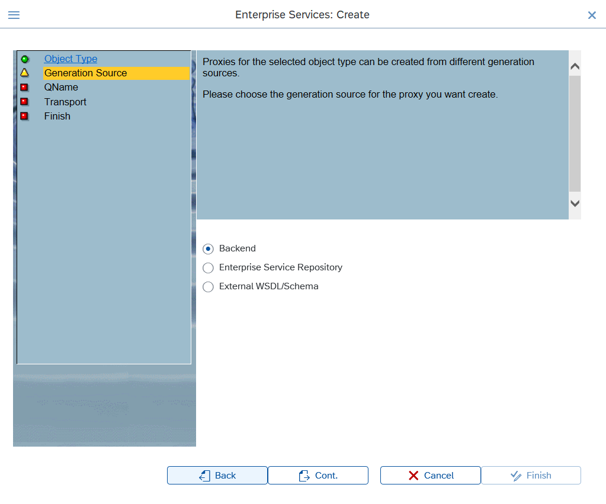

- "Service Interface"
  - `Name`
  - `Namespace`

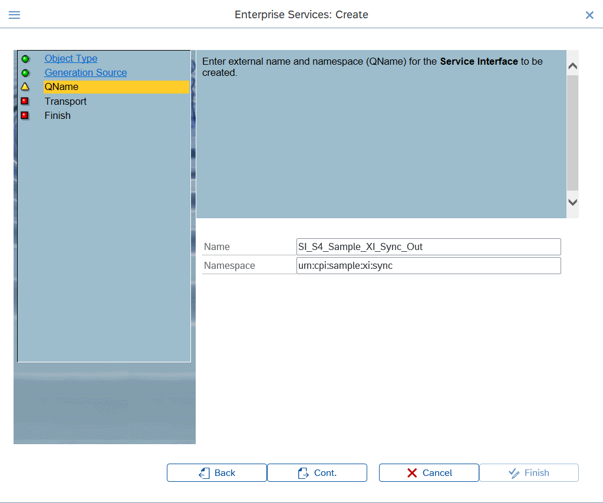

- "Operation"
  - `EXECUTE`
 
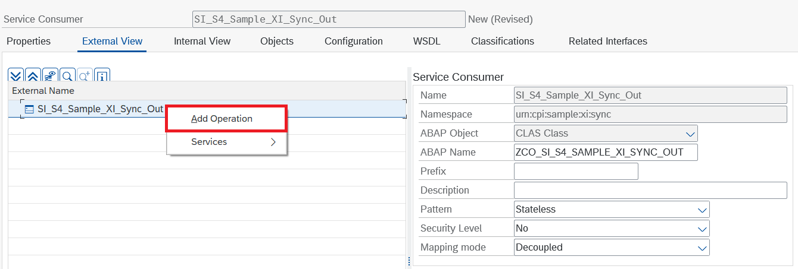
<!--  -->

### Message Type Request

- Criar `Message Type`
  - `MT_S4_Sample_XI_Sync_Req`

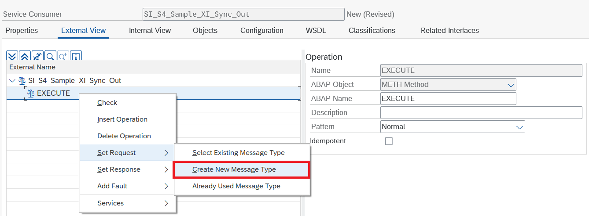

- Criar `Data Type`
  - `DT_S4_Sample_SOAP_Sync_Req`

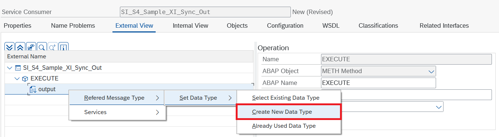

- Adicionar segmentos no data type criado
  - `id`

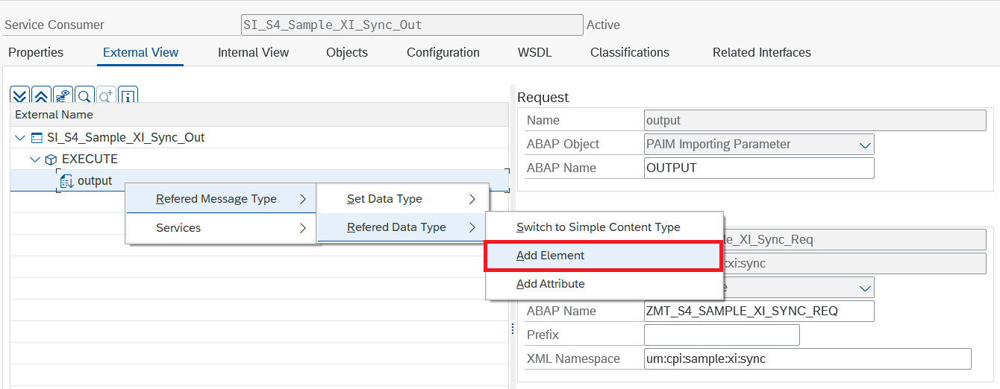
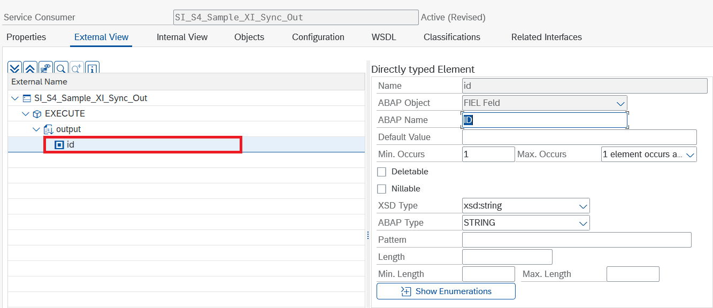

### Message Type Response

- Criar `Message Type`
  - `MT_S4_Sample_SOAP_Sync_Res`

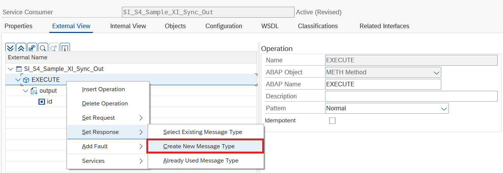 
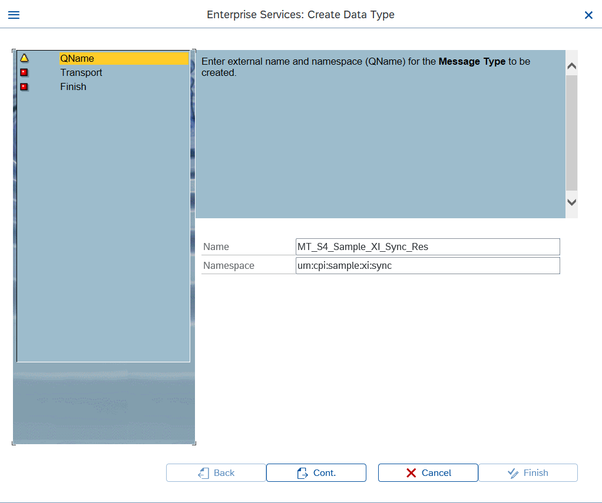

- Criar `Data Type`
  - `DT_S4_Sample_SOAP_Sync_Res`

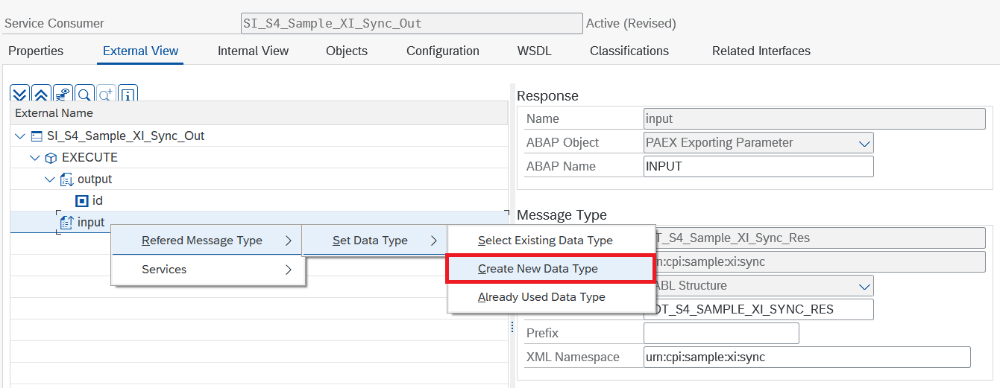

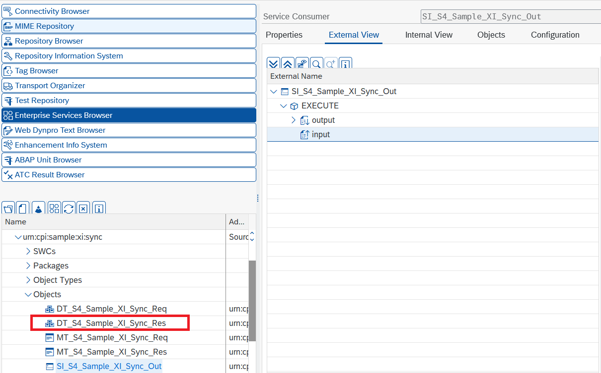

- Adicionar segmentos no data type criado
  - `id`
  - `name`
  - `username`
  - `email`

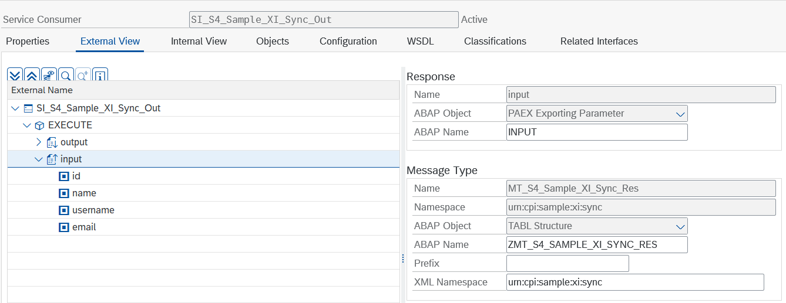