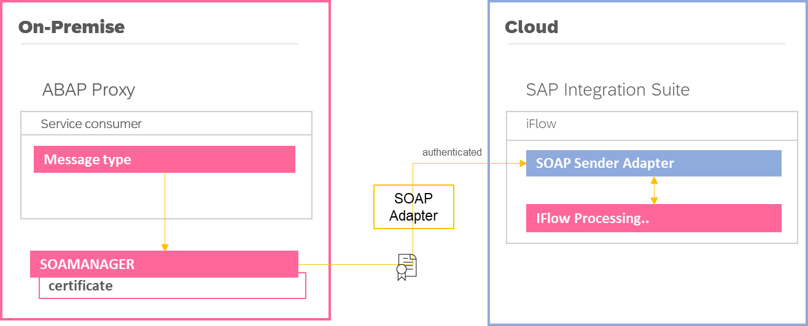
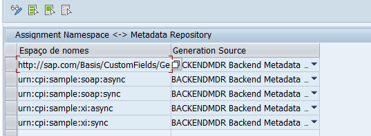
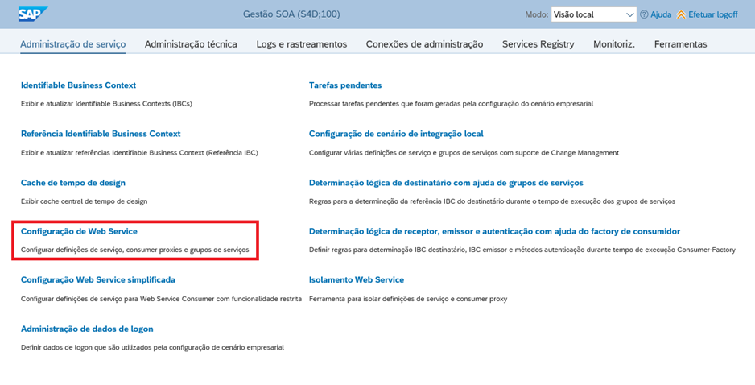
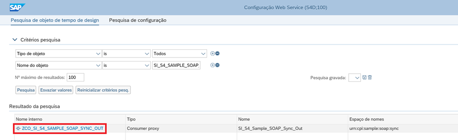
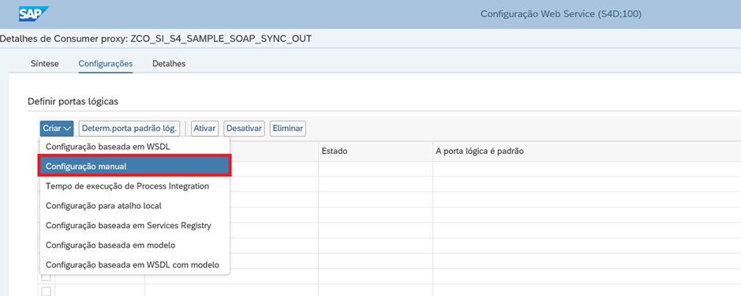
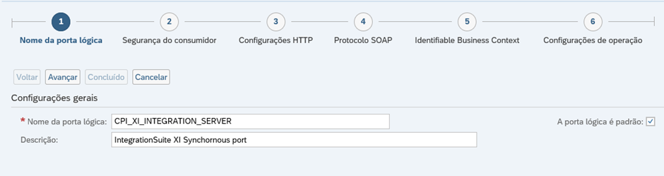
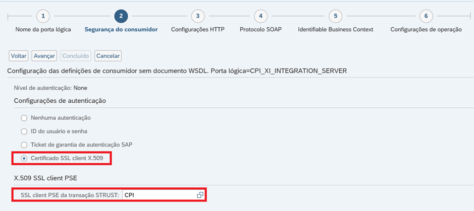
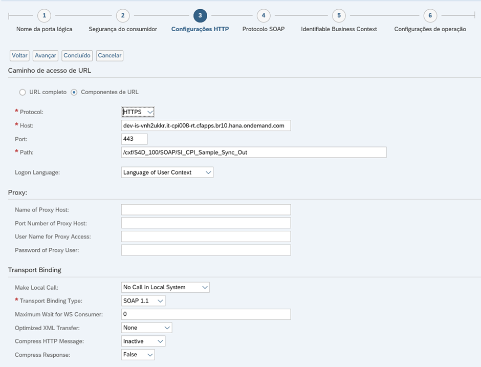
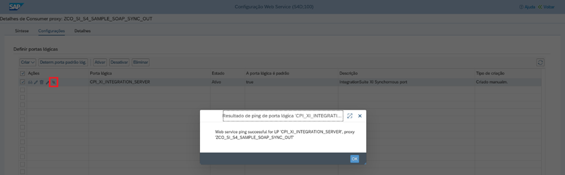

> 
> **ℹ️ Para desenvolver serviços nos quais não é utilizado um serviço WSDL, opte por:**
> - [**Criação de proxies baseados em protocolo XI**](#)
> 

# **Criação de proxies baseados em protocolo SOAP**

- Tipo de comunicação: `INBOUND`
- Protocolo: `SOAP`
- Emissor: `S/4 HANA`
- Receptor: `SAP CPI`

## Visão geral

- Forma de comunicação `Sincrona` ou `Assincrona`
- Alta disponibilidade
- Rastreabilidade (`SRT_UTIL`).
- **NÃO HÁ NECESSIDADE DE API MANAGEMENT**

Este documento tem como objetivo fornecer orientações aos desenvolvedores ao longo do processo de criação de integrações destinadas ao envio de dados ao SAP `Integration Suite` por meio de web services, que tenham como sistema origem o `SAP S/4 HANA`.

## Índice

- [**Criação de proxies baseados em protocolo SOAP**](#criação-de-proxies-baseados-em-protocolo-soap)
  - [Visão geral](#visão-geral)
  - [Índice](#índice)
      - [Casos de uso](#casos-de-uso)
  - [Walkthrough](#walkthrough)
    - [1) Namespace](#1-namespace)
    - [2) Proxy](#2-proxy)
    - [3) SOAMANAGER](#3-soamanager)
      - [Configuração de Web Service](#configuração-de-web-service)
      - [Criar configuração manual](#criar-configuração-manual)
  - [Testes e Monitoramento](#testes-e-monitoramento)
    - [Testes](#testes)
    - [Monitoramento](#monitoramento)

#### Casos de uso

- Web services criados através da transação `SOAMANAGER`(maior relevância)
- Serviços proxies do tipo `service consumer`, que transmitem dados a sistemas externos através do adapter `SOAP` (endpoint contém policies)

> ✏️ _[... mantenha essa lista atualizada sempre que encontrar novos casos de uso]_

> ℹ️ Não há necessidade de recorrer ao API Management, uma vez que estamos consumindo uma API por meio do próprio `iFlow`, sendo assim seu uso torna-se desnecessário e redundante.

## Walkthrough

Neste exemplo, procederemos com a configuração de um proxy que estabelece conexão direta com o `Integration Suite` por meio de um iFlow através de comunicação `Sincrona`.

Este `iFlow` realizará a integração com a API pública [JSON Placeholder](https://jsonplaceholder.typicode.com/), e o resultado da chamada a essa API será encaminhado de volta para o proxy.

### 1) Namespace

Na configuração atual do ambiente do cliente, não há a presença do middleware de integração `SAP PI/PO` (baseado on-premise) conectado de forma conjunta ao `S/4 HANA`. A responsabilidade por integrações recai exclusivamente sobre o `SAP Integration Suite` (baseado em nuvem).

Diante dessa configuração, torna-se necessário a criação manual de `namespaces`, permitindo assim unificar objetos de integração em único pacote e estabelecer uma comunicação segura com o `SAP BTP`.

- Acessar transação `SPXNGENAPPL`
  - Generation Source: `BACKENDMDR`
  

Uma vez criado, o namespace torna-se disponível na transação `SPROXY`.

### 2) Proxy

Os passos seguintes descrevem o processo de criação do proxy, tomando como base o namespace previamente estabelecido

> ℹ️ Ver documento [**Como criar proxy** `SOAP`](/cpi/sproxy/como-criar-proxy-soap-sync.md).

### 3) SOAMANAGER

Os passos relacionados ao `SOAMANAGER` descrevem os métodos e protocolos a serem utilizados pelo proxy, afim de garantir comunicação entre o `backend` e a `nuvem`.

#### Configuração de Web Service

- Selecionar proxy

#### Criar configuração manual

- Definir a porta lógica pelo qual a comunicação será estabelicidade entre o proxy e o `IntegrationSuite`.

- Informar o keystore `CPI`. O mesmo pode ser encontrado na transação `STRUST`.

Ao alcançar esta etapa, espera-se que o iFlow já esteja devidamente criado. Esta configuração aborda especificamente a forma como o proxy se conectará no `Integration Suite`, e qualquer interação subsequente no proxy pode ser monitorada por meio da transação `SRT_UTIL`.

- Configuração HTTP
  - Protocolo: `HTTPS`
  - Host: `dev-is-vnh2ukkr.it-cpi008-rt.cfapps.br10.hana.ondemand.com`
  - Port: `443`
  - Path: `/cxf/S4D_100/SOAP/SI_CPI_Sample_Sync_Out`

> Este exemplo utiliza o iFlow [SI_S4_Sample_SOAP_Sync](https://dev-is-vnh2ukkr.integrationsuite.cfapps.br10.hana.ondemand.com/shell/design/contentpackage/ZTestarea/integrationflows/SI_S4_Sample_SOAP_Sync)

Por fim, um teste de conexão se faz necessário para verificar se a comunicação foi devidamente estabelecida.

## Testes e Monitoramento

### Testes

A integração criada acima pode ser testada através dos programas abaixo:

| Report                      | Proxy                         | Namespace                  | Tipo de comunicação |
| --------------------------- | ----------------------------- | -------------------------- | :-----------------: |
| `Z_TEST_SPROXY_SOAP_SYNC`   | `SI_S4_Sample_SOAP_Sync_Out`  | urn:cpi:sample:soap:sync   | Sincrono            |
| `Z_TEST_SPROXY_SOAP_ASYNC`  | `SI_S4_Sample_SOAP_Async_Out` | urn:cpi:sample:soap:async  | Assincrono          |

A cada execução, novos registros são gerados na transação `SRT_UTIL`, exibindo detalhes e status da comunicação. Isso mantém a rastreabilidade ativa sobre as integrações.

### Monitoramento

A transação `SRT_UTIL` desempenha o papel fundalmental de monitoramento de serviços web em ambientes SAP.