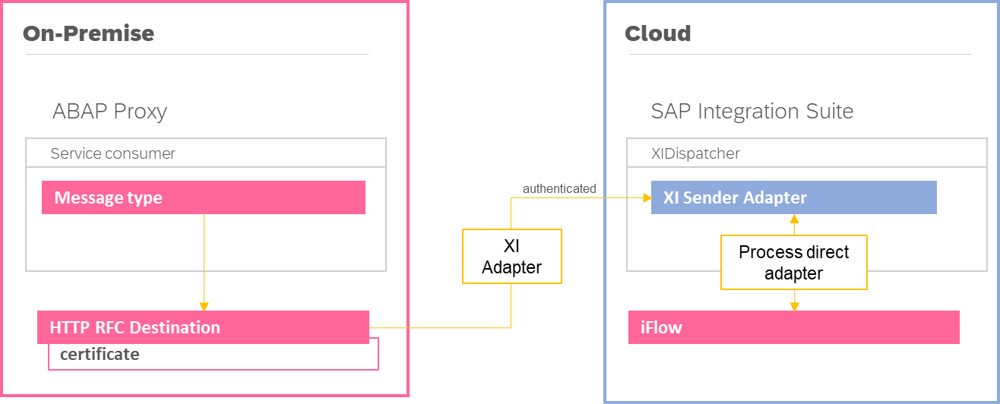

# **Criação de proxies baseados em protocolo `XI`**

- Tipo de comunicação: `INBOUND`
- Protocolo: `XI`
- Emissor: `S/4 HANA`
- Receptor: `SAP CPI`

## Visão geral

- Forma de comunicação `Sincrona` ou `Assincrona`
- Alta disponibilidade
- Rastreabilidade (`SXI_MONITOR`).
- **NÃO HÁ NECESSIDADE DE API MANAGEMENT**

Este documento tem como objetivo fornecer orientações aos desenvolvedores ao longo do processo de criação de integrações destinadas ao envio de dados ao SAP `Integration Suite` por meio de web services, que tenham como sistema origem o `SAP S/4 HANA`.

## Índice

- [**Criação de proxies baseados em protocolo `XI`**](#criação-de-proxies-baseados-em-protocolo-xi)
  - [Visão geral](#visão-geral)
  - [Índice](#índice)
      - [Casos de uso](#casos-de-uso)
  - [Walkthrough](#walkthrough)
    - [1) Namespace](#1-namespace)
    - [2) Proxy](#2-proxy)
    - [3) Configurar `ID do emissor/receptor`](#3-configurar-id-do-emissorreceptor)
    - [4) Configurar `Integration Engine`](#4-configurar-integration-engine)
  - [Testes e Monitoramento](#testes-e-monitoramento)
    - [Testes](#testes)
    - [Monitoramento](#monitoramento)
    - [Troubleshoot](#troubleshoot)
      - [**1) Business Communication Error**](#1-business-communication-error)

#### Casos de uso

- Serviços proxies do tipo `service consumer`, que transmitem dados a sistemas externos através do adapter `XI` (endpoint não contém policies)

> ✏️ _[... mantenha essa lista atualizada sempre que encontrar novos casos de uso]_

> ℹ️ Não há necessidade de recorrer ao API Management, uma vez que estamos consumindo uma API por meio do próprio `iFlow`, sendo assim seu uso torna-se desnecessário e redundante.

## Walkthrough

Neste exemplo, procederemos com a configuração de um proxy que estabelece conexão direta com o `Integration Suite` por meio de um iFlow através de comunicação `Sincrona`.

Este `iFlow` realizará a integração com a API pública [JSON Placeholder](https://jsonplaceholder.typicode.com/), e o resultado da chamada a essa API será encaminhado de volta para o proxy.

### 1) Namespace

Na configuração atual do ambiente do cliente, não há a presença do middleware de integração `SAP PI/PO` (baseado on-premise) conectado de forma conjunta ao `S/4 HANA`. A responsabilidade por integrações recai exclusivamente sobre o `SAP Integration Suite` (baseado em nuvem).

Diante dessa configuração, torna-se necessário a criação manual de `namespaces`, permitindo assim unificar objetos de integração em único pacote e estabelecer uma comunicação segura com o `SAP BTP`.

- Acessar transação `SPXNGENAPPL`
  - Generation Source: `BACKENDMDR`
  

Uma vez criado, o namespace torna-se disponível na transação `SPROXY`.

### 2) Proxy

Os passos seguintes descrevem o processo de criação do proxy, tomando como base o namespace previamente estabelecido.

> ℹ️ Ver documento [**Como criar proxy** `XI`](/cpi/sproxy/como-criar-proxy-xi-sync.md).

### 3) Configurar `ID do emissor/receptor`

Para habilitar o funcionamento dos proxies do cliente no servidor de aplicativos, é necessário que o `Integration Engine` esteja devidamente configurado.

Acessar a transação `SXMB_ADM` > `Configure Sender/Receiver ID`

Crie uma entrada referente ao namespace da interface eg.: `urn:cpi:proxy`. 

Cada proxy gerado nesse namespace será configurado com o ID do Remetente/Receptor.

### 4) Configurar `Integration Engine`

Acessar a transação `SXMB_ADM` > `Integration Engine Configuration`

Assim que a configuração for aberta, crie uma nova entrada conforme descrito abaixo:

| Category   | Parameters     | Subparameter   | Current Value
|------------|----------------|----------------|---------------------------------
| `RUNTIME`  | `ENGINE_TYPE`  |                | LOC
| `RUNTIME`  | `HTTP_TIMEOUT` |                | 1800
| `RUNTIME`  | `IS_URL`       | `CPI_OUTBOUND` | dest://CPI_XI_INTEGRATION_ENGINE

Considerações ao configurar o parâmetro `IS_URL` incluem a correlação do subparâmetro com as configurações criadas em `Configurar ID do Remetente/Receptor`. 

O valor indica o destino associado ao Integration Suite (CPI), previamente configurado e que aponta para o iFlow dispatcher.

## Testes e Monitoramento

### Testes

A integração criada acima pode ser testada através dos programas abaixo:

| Report                    | Proxy                       | Namespace                | Tipo de comunicação |
| ------------------------- | --------------------------- | ------------------------ | :-----------------: |
| `Z_TEST_SPROXY_XI_SYNC`   | `SI_S4_Sample_XI_Sync_Out`  | urn:cpi:sample:xi:sync   | Sincrono            |
| `Z_TEST_SPROXY_XI_ASYNC`  | `SI_S4_Sample_XI_Async_Out` | urn:cpi:sample:xi:async  | Assincrono          |

A cada execução, novos registros são gerados na transação `SRT_UTIL`, exibindo detalhes e status da comunicação. Isso mantém a rastreabilidade ativa sobre as integrações.

### Monitoramento

A transação `SXI_MONITOR` desempenha o papel de monitoramento de chamadas externas.

### Troubleshoot

#### **1) Business Communication Error**

Para se certificar que a configuração de Business System (`LOC`) está devidamente configurada, execute o módulo de função `LCR_GET_OWN_BUSINESS_SYSTEM`.

O resultado esperado é a concatenação "SystemID"_"Client". eg.: `S4P_200`. 

Caso o módulo de função apresente erros durante a execução, verifique o conteúdo da tabela `LCRT_CLNTCACHE`, e crie as devidas entradas quando não existir.