# abap-atc

- [abap-atc](#abap-atc)
    - [Visão geral](#visão-geral)
      - [code-pal-for-abap](#code-pal-for-abap)
    - [Configuração `SCI`](#configuração-sci)
      - [Atributos](#atributos)
      - [Uso de pragma:](#uso-de-pragma)
      - [Gravidade da Mensagem (Message Severity)](#gravidade-da-mensagem-message-severity)
    - [Configuração `ATC`](#configuração-atc)
      - [Configuração para bloqueio de Transporte:](#configuração-para-bloqueio-de-transporte)
      - [Provedor de objetos](#provedor-de-objetos)
      - [Isenção](#isenção)
      - [Configuração de Isenção](#configuração-de-isenção)
    - [Cursos Interessantes](#cursos-interessantes)

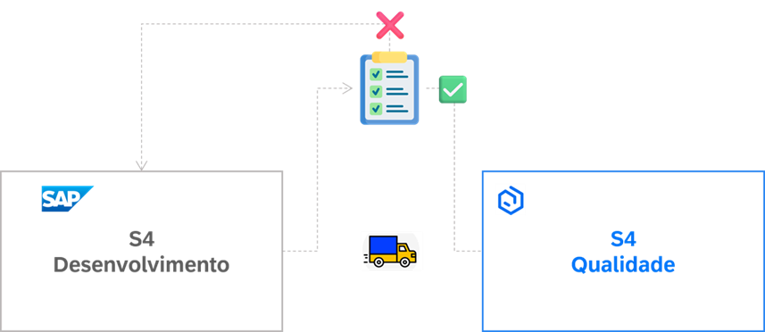

### Visão geral

Este documento tem como objetivo explicar o uso do workbook e sua automação durante o processo de desenvolvimento ABAP em ambiente SAP, fornecendo uma compreensão abrangente do processo e suas implicações, visando melhorar a eficiência e a qualidade do desenvolvimento.

ABAP ATC (ABAP Test Cockpit) é uma ferramenta de análise estática de código para ABAP. O ATC permite aos desenvolvedores verificar seus códigos em busca de problemas de qualidade, como:

- Vulnerabilidades de segurança
- Violações de padrões de codificação
- Possíveis erros e otimizações de desempenho.
- Garantir que o workbook de desenvolvimento foi implementado

Assim, ajuda a identificar potenciais problemas antes mesmo da fase de teste, ajudando a melhorar a qualidade do software desenvolvido e a manter a integridade do sistema.

#### code-pal-for-abap

Para garantir que o workbook de desenvolvimento seja verificado, utilizamos o projeto [**code-pal-for-abap**](https://github.com/SAP/code-pal-for-abap?tab=readme-ov-file). Esta ferramenta fornece um conjunto de verificações para ajudar a aderir ao _style guide_ [**Clean ABAP**](https://github.com/SAP/styleguides/blob/main/clean-abap/CleanABAP.md).

O link abaixo explica detalhadamente a ativação do _Clean ABAP_ dentro da solução _ATC_.

> https://github.com/SAP/code-pal-for-abap

Instalação e ativação dos objetos de verificação é realizado através do ABAP Git(https://docs.abapgit.org/user-guide/getting-started/install.html)

Programa ABAP GIT:ZABAPGIT_STANDALONE
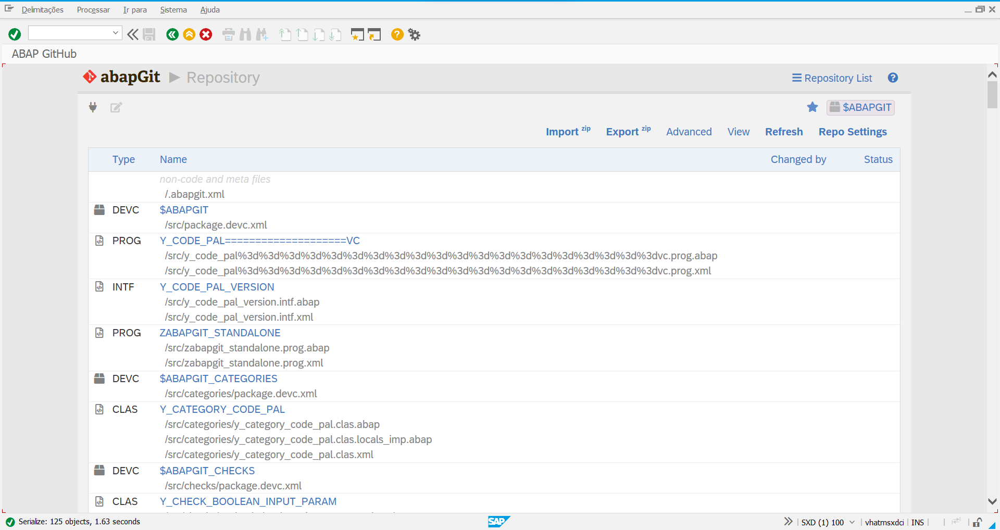
 
### Configuração `SCI`

> Acessar a transação `SCI`

A variante de verificação `Y_CODE_PAL` contém as verificações referente ao _Clean ABAP_. 

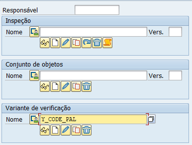

Ainda é possível criar novas checagens customizáveis através da classe `Y_CHECK_BASE`.

> Ver mais detalhes em [code-pal-for-abap/foundation](https://github.com/SAP/code-pal-for-abap/tree/master/src/foundation)

Na opção `Grupo ATEM - Workbook (code pal for ABAP)`, é possível verificar as checagens que são realizadas durante o processamento de ATC.

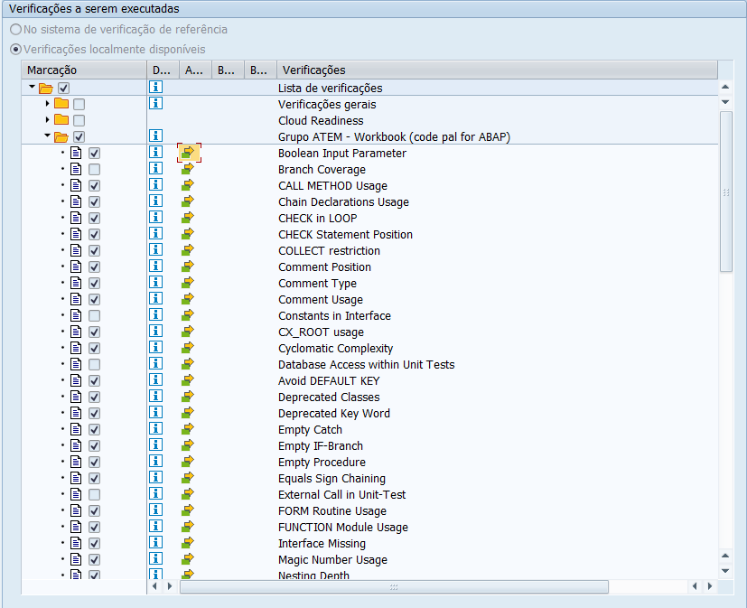

É possível realizar a configuração de data e severidade de cada problema:

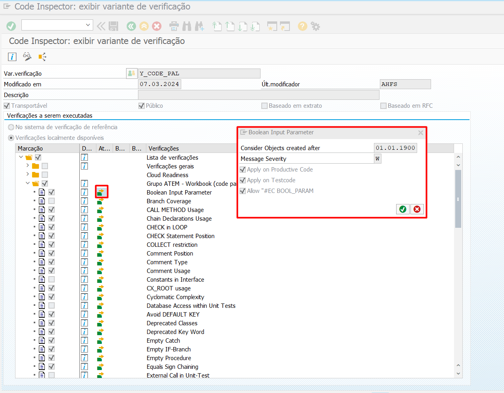

#### Atributos

Aqui é possível verificar os atributos relacionados ao código de ATC, tais como:

#### Uso de pragma:

Com esta opção, é possível ocultar a mensagem durante a verificação ATC. No entanto, é preferível que *todas* as mensagens sejam devidamente corrigidas.

No exemplo abaixo, o uso do pragma `EC CALL_METH_USAGE` não está habilitado, portanto, seu uso não terá efeito.

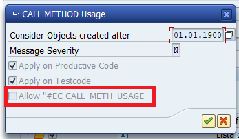

#### Gravidade da Mensagem (Message Severity)

| Severity    | ATC Prio   | Ação                |
| ----------- |:----------:| ------------------- |
| Error       | `1`        | Deve ser ajustados  |
| Warning     | `2`        | Deve ser ajustados  |
| Information | `3-4`      | Opcional (mas é preferível que resolva 😊) |

### Configuração transação `ATC`

A verificação ATC é baseado no ABAP Clean Code, como mencionado acima na documentação. A configuração aborda o bloqueio da request caso não esteja no padrão correto.

> Ver mais detalhes em [Setting Up ATC Transport Checking](https://help.sap.com/docs/ABAP_PLATFORM_NEW/ba879a6e2ea04d9bb94c7ccd7cdac446/40c14df0a883467bb90ef5a70cee7cc2.html)

#### Configuração para bloqueio de Transporte:

Podemos identificar que a verificação é realizada em Tasks, Request e TR.

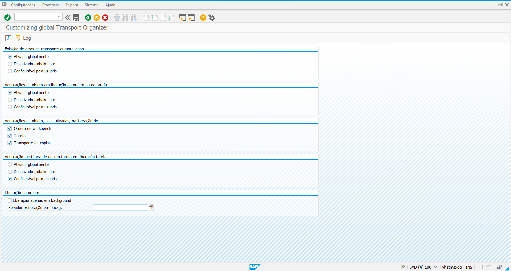

Variante de configuração global configurada de acordo com o projeto [**code-pal-for-abap**], podemos checar na transação ATC:

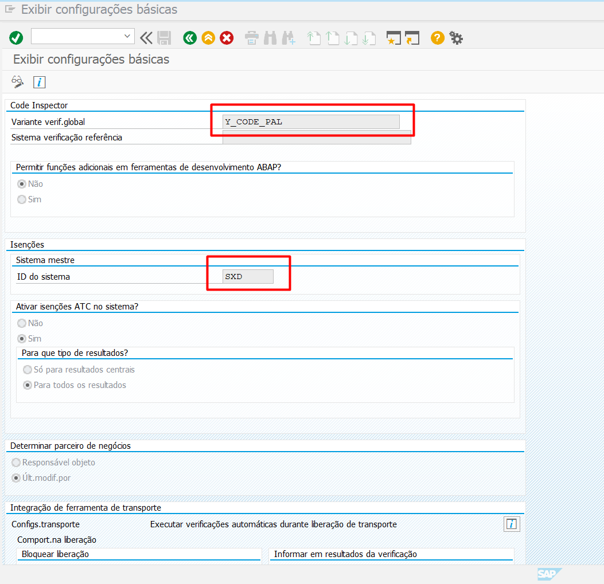

Validações na liberação da request:

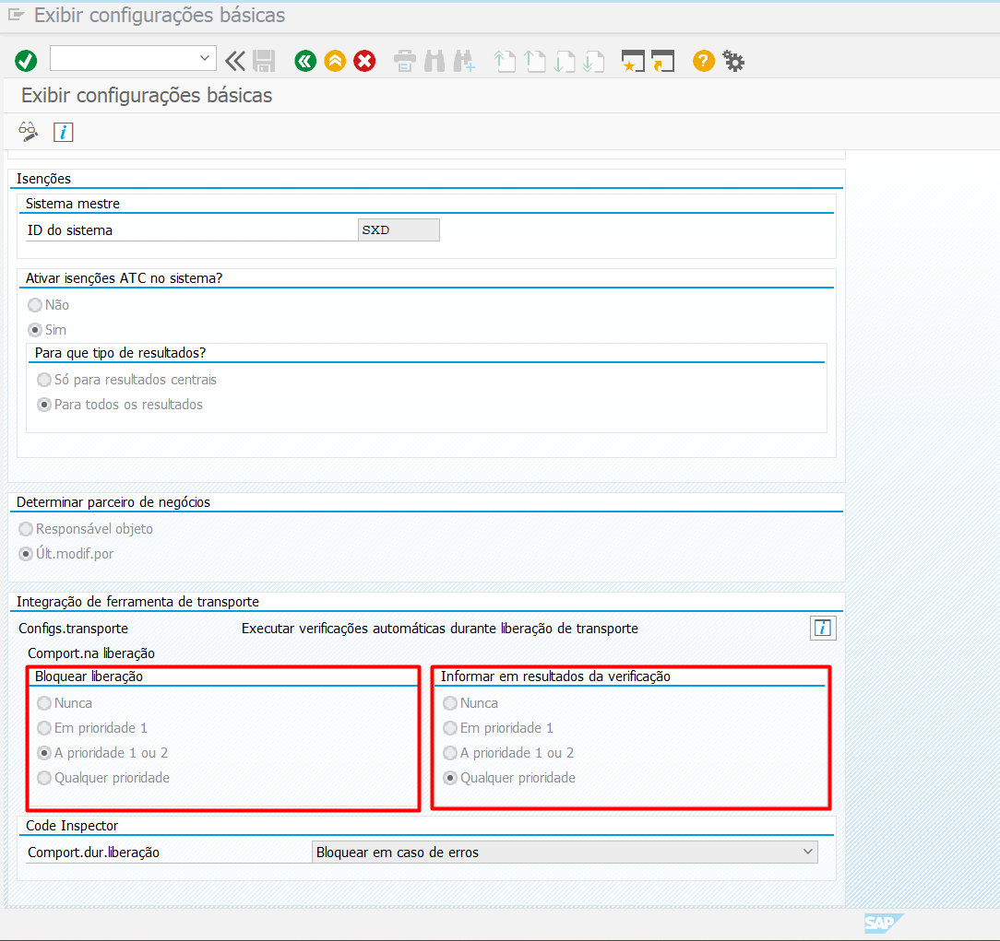

Esta verificação é configurável via tcode ATC (Tabela: TRCHECK contém detalhes de todas as verificações presentes no sistema).
> Ver mais detalhes em [Setting Up ATC Transport Checking](https://help.sap.com/docs/SAP_NETWEAVER_AS_ABAP_751_IP/ba879a6e2ea04d9bb94c7ccd7cdac446/40c14df0a883467bb90ef5a70cee7cc2.html?version=7.51.4&locale=en-US)

Toda configuração da variante conseguimos verificar na tabela SCICHKV_ALTER.

Tabela: SCICHKV_ALTER substitui as variantes de verificação padrão fornecidas pela SAP.

Tabela: SCICHKV_ALTER é entregue pela nota: 1465965.

Conforme nota: 1465965, ATC tem variante de verificação padrão como “DEFAULT” e variante de verificação padrão do inspetor de código é “TRANSPORT” para liberação de TR. Sendo assim, conseguimos fazer a modificação para o nosso cenário customizado, utilizando a variante atrelado ao projeto code-pal-for-abap.

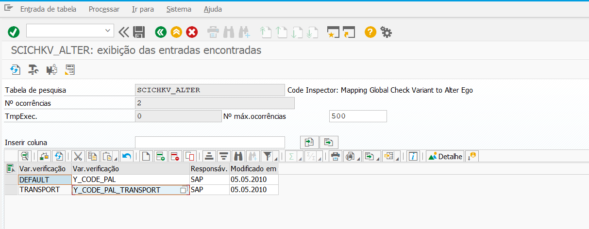

> Ver mais detalhes em [Configuration for ATC / Code Inspector check before releasing transport request](https://community.sap.com/t5/application-development-blog-posts/configuration-for-atc-code-inspector-check-before-releasing-transport/ba-p/13374720)

#### Provedor de objetos

Podemos verificar que é realizado a verificação no próprio ambiente:
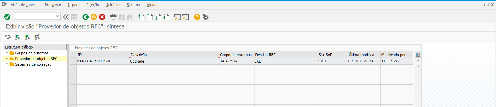

> Ver mais detalhes em [Configuring Object Providers](https://help.sap.com/doc/saphelp_nw75/7.5.5/en-us/f0/507b09b1a64029a88ff994cae03aac/content.htm?no_cache=true)

#### Isenção

É possível realizar [solicitação de isenção para transporte](https://help.sap.com/docs/SAP_NETWEAVER_AS_ABAP_FOR_SOH_740/ba879a6e2ea04d9bb94c7ccd7cdac446/3a759579e173410caa551e0d428bd7d6.html?locale=en-US&version=7.40.18), isso passa por uma avaliação do QA/QE (quality assurance/quality enginnering). No entanto, é válido ressaltar que os pedidos de isenção deve ser realizado aénas a um problema que seja um falso positivo ou que atualmente não possa ser reparado.  É primordial que as mensagens sejam devidamente corrigidas.

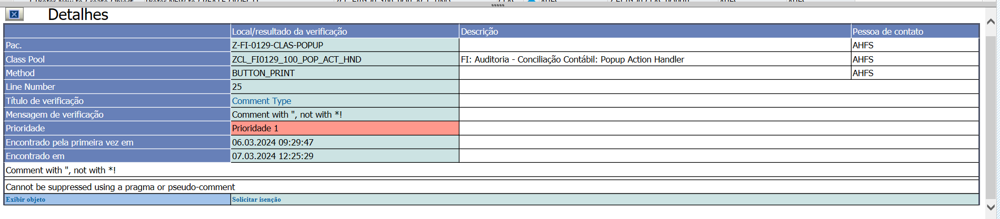

> Ver mais detalhes em [Guia para solicitação de isenção](https://help.sap.com/docs/SAP_NETWEAVER_AS_ABAP_FOR_SOH_740/ba879a6e2ea04d9bb94c7ccd7cdac446/4d6b1d35809b4f7280b18abb5a30d734.html?version=7.40.18&locale=en-US)

Assim que uma solicitação é aberta, é encaminhado um e-mail ao aprovador para a devida análise ser realizada.

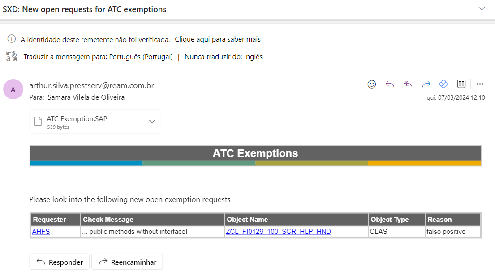

> Ver mais detalhes em [Setting Up Automatic Notification When Exemptions Arrive](https://help.sap.com/docs/SAP_NETWEAVER_AS_ABAP_FOR_SOH_740/ba879a6e2ea04d9bb94c7ccd7cdac446/56ea2bc68ad045678e505ea2ab387f49.html?version=7.40.18&locale=en-US)

Configuração de envio de e-mails para aprovadores e desenvolvedores:
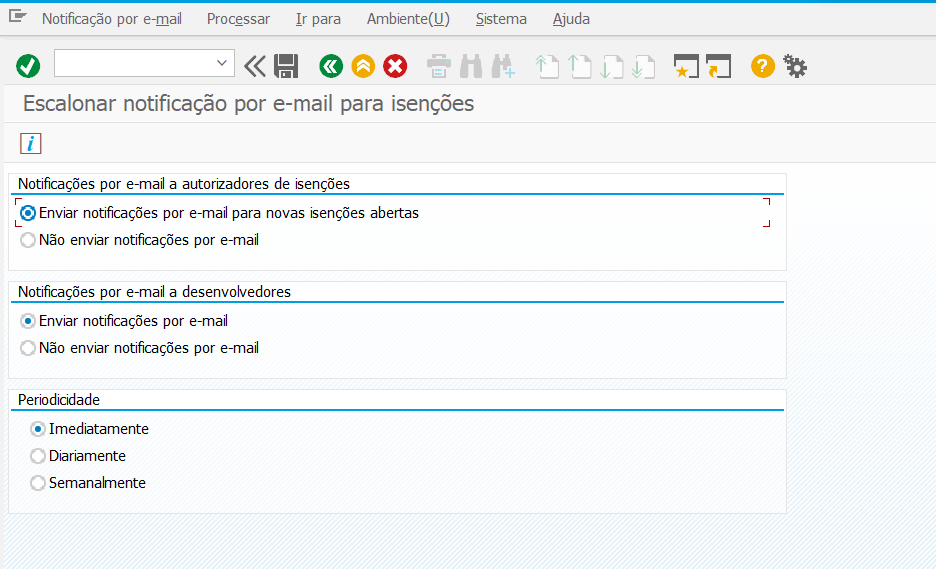

#### Configuração de Isenção

Uma isenção entra em vigor somente depois que um gerente de qualidade aprova a isenção.

É possível configurar os pedidos de isenção permitidos através da transação ATC. Atualmente está tudo habilitado:

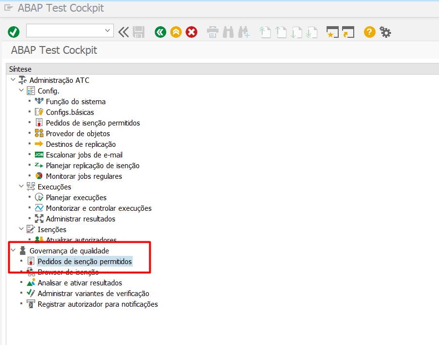

Manutenção dos aprovadores ATC:

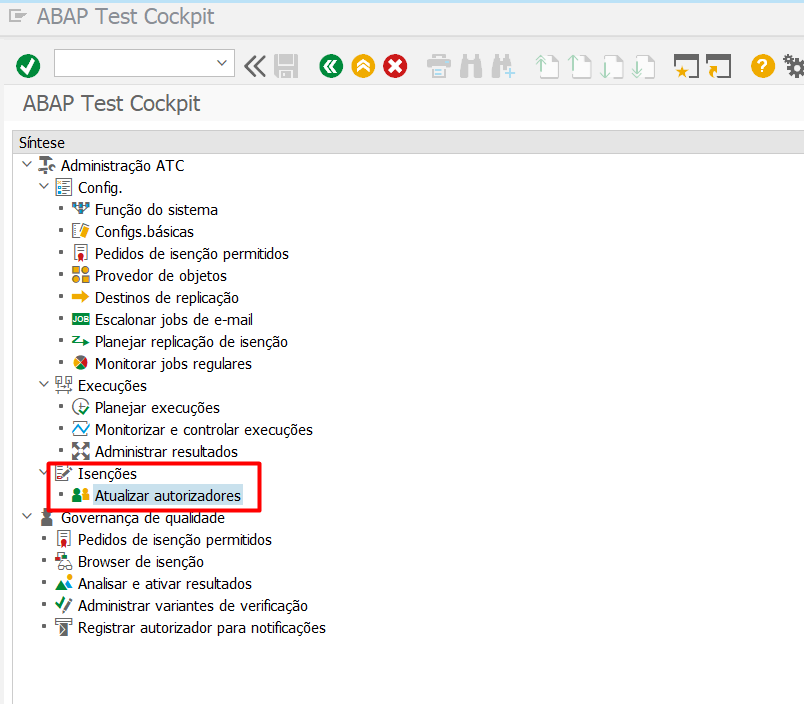

> Ver mais detalhes em [Maintaining the List of ATC Approvers](https://help.sap.com/docs/SAP_NETWEAVER_AS_ABAP_FOR_SOH_740/ba879a6e2ea04d9bb94c7ccd7cdac446/974d4e35ca7c46629636d713cae45c17.html?version=7.40.18&locale=en-US)

### Naming Space
As convenções se aplicam aos nomes de todos os objetos definíveis nos programas ABAP, como tipos de dados, objetos de dados, classes, macros e procedimentos.

Por enquanto, foi implementado verificação de nomenclatura para:

Nomenclatura para classe: ZCL_*,ZCX_*,ZCA_*
Nomenclatura para interface: ZIF_*

> Ver mais detalhes em [Naming Conventions in ABAP Objects](https://help.sap.com/doc/saphelp_nw73ehp1/7.31.19/en-US/92/c2b084bc1d11d2958700a0c94260a5/content.htm?no_cache=true)

### Cursos Interessantes

- https://open.sap.com/courses/wtc1

- https://open.sap.com/courses/a4h1
