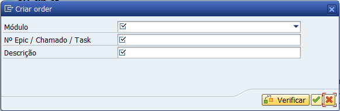

# abap-transport-request

Ao criar novos tipos de transporte, como `Workbench` e `Customizing`, a nomenclatura referente ao nome do pedido é gerada automaticamente. 

Portanto, ao criar um novo transporte, o popup é apresentado:

