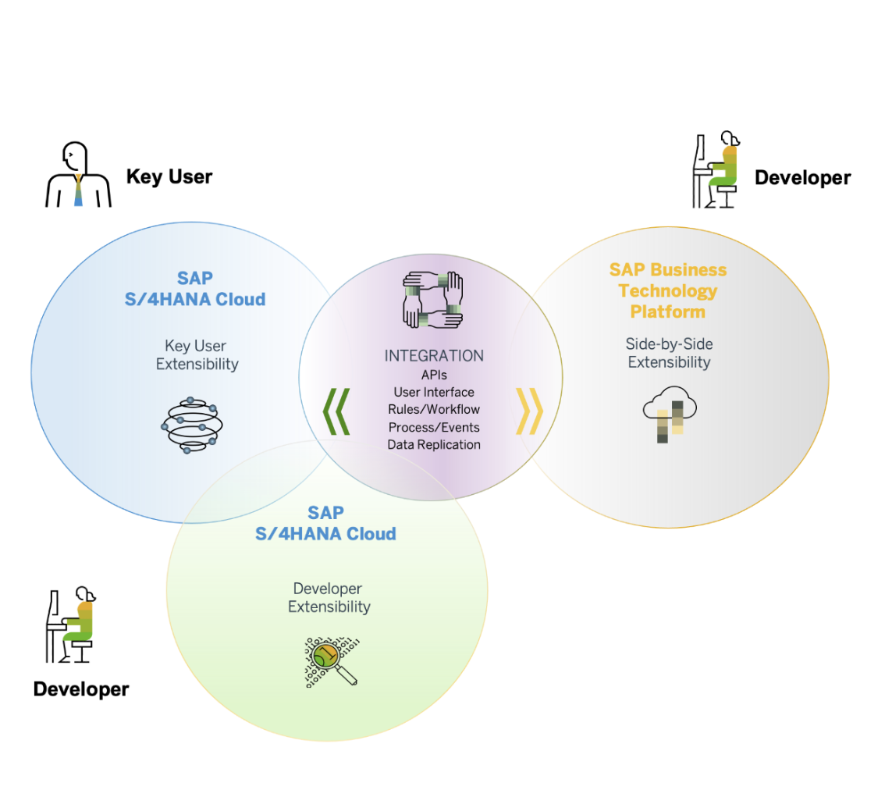
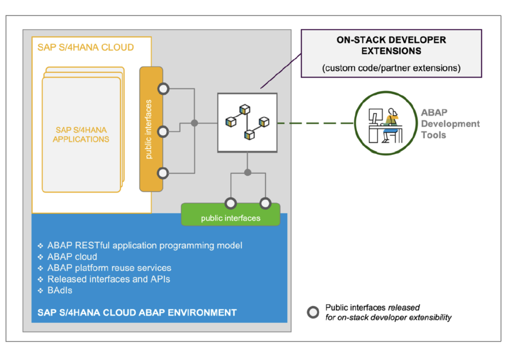
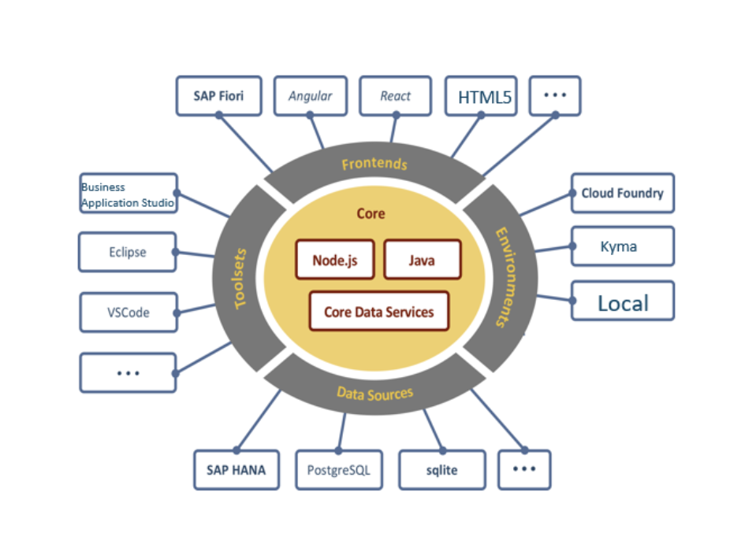
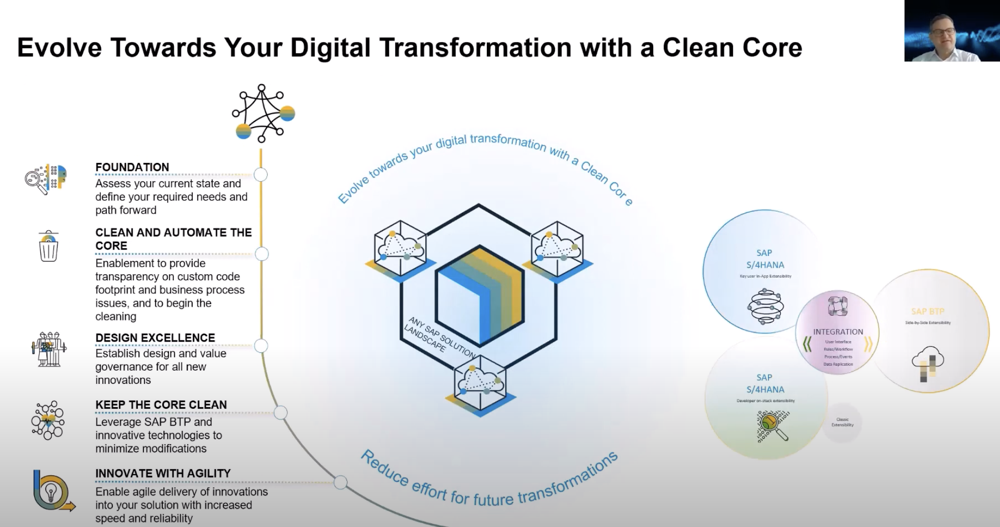
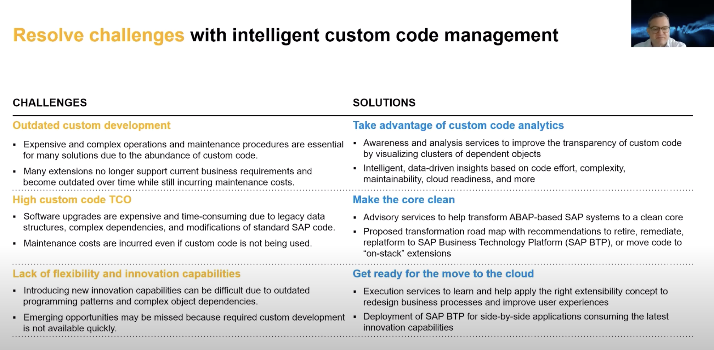

# Extensibility

- [Formas de Desenvolvimento](#entrega-de-aplicativo-fiori-para-o-sistema-s4-on-premise)
    - [Key-user extensibility](#key-user-extensibility)
    - [Developer Extensibility (Embedded Steampunk)](#o-que-e-extensibilidade-do-desenvolvedor-on-stack)
    - [Side-by-side extensions on SAP BTP](#o-que-e-extensibilidade-lado-a-lado)
    - [Referências](#referências)

 

A extensibilidade do usuário principal permite que especialistas de negócios criem extensões para o SAP S/4HANA Cloud, principalmente sem uma única linha de código .

The basic buildings blocks of the extensibility concept are:

- “On-stack” extensibility using
 1. key user extensibility tools
 2. developer extensibility (aka SAP S/4HANA Cloud Environment or “Embedded Steampunk”, introduced with SAP S/4HANA Cloud 2208 and SAP S/4HANA 2022)
 3. classical extensibility (aka classic ABAP custom development)
- Side-by-side extensibility with SAP BTP using
 1. Low code extensions on SAP BTP created with SAP Build
 2. Extensions on SAP BTP developed with SAP Build Code, using the SAP BTP environments and services, such as Java or Node.JS
 3. SAP BTP ABAP Environment

- O que é o Paradigma do Núcleo Limpo?

Clean core é uma metodologia de extensão na qual:

As extensões são mantidas estritamente separadas do aplicativo SAP.

As extensões acessam objetos de negócios SAP somente por meio de interfaces bem definidas e com atualização estável

### O que é extensibilidade do desenvolvedor (on-stack)?

- A extensão precisa de proximidade e acoplamento com dados/transações/aplicativos do SAP S/4HANA Cloud
- Requer recursos de desenvolvimento como depuracao.
- Leitura de dados de clientes e dados SAP em consultas SQL complexas e com alto volume de dados

As extensões on-stack são desenvolvidas e executadas na mesma pilha de software que o sistema SAP S/4HANA Cloud subjacente. Isso permite que as extensões acessem a lógica e os dados do SAP S/4HANA por meio de pontos de extensão SAP , APIs SAP locais ou por meio de consultas SQL .

As extensões clássicas colocam em risco atualizações suaves e tornam mais difíceis as etapas adicionais de transformação da nuvem. Portanto, a reutilização do modelo de extensibilidade SAP S/4HANA Cloud também em nuvem privada ou implantações locais é benéfica e recomendada.

### O que é extensibilidade lado a lado?

A extensibilidade lado a lado permite criar extensões no SAP BTP . A verdadeira dissociação entre suas extensões e o SAP S/4HANA permite um ciclo de vida independente e permite que você crie e desenvolva aplicativos com muito mais rapidez .

A extensão nao precisa de proximidade e acoplamento com dados/transações/aplicativos do SAP S/4HANA Cloud

- Modelo de programacao: CAP, RAP, PHYTON, BUILD

O que é o modelo de programação de aplicativos em nuvem SAP (CAP)?

O CAP não é um produto específico, mas uma estrutura, um conjunto de ferramentas, linguagens e bibliotecas que:

Reúne tecnologias próprias da SAP, como SAP Business Application Studio, Core Data Services (CDS), SAP HANA e tecnologias de código aberto como Node.js ou Java

O que é o modelo de programação de aplicativos RESTful (RAP) ABAP?

RAP é um conjunto de conceitos, ferramentas, linguagens, frameworks e melhores práticas fornecidas na plataforma ABAP.

O RAP está disponível para:

Ambiente SAP BTP ABAP (também conhecido como Steampunk)

Ambiente SAP S/4HANA ABAP (também conhecido como Steampunk incorporado)

### O que é o modelo de extensibilidade de três camadas para nuvem privada/OP S/4HANA?

### ABAP CLOUD

Desenvolvimento ABAP Cloud significa:

Use APIs SAP públicas (locais ou remotas) lançadas pela SAP para acessar funcionalidades e dados SAP.

Use pontos de extensão SAP públicos liberados pela SAP para estender objetos SAP. Modificações em objetos SAP não são suportadas.

Use ADT (ferramentas de desenvolvimento ABAP) como seu ABAP IDE

Use RAP (ABAP RESTful Application Programming Model) para criar aplicativos e serviços Fiori. Tecnologias SAP como Dynpro ou Web Dynpro não são liberadas para desenvolvimento ABAP Cloud

Steampunk: crie aplicativos e extensões ABAP Cloud no SAP BTP (lado a lado com SAP S/4HANA)

Steampunk incorporado: crie extensões ABAP Cloud no SAP S/4HANA (todas as edições)

OBS: Acesso a tabelas SAP nao e mais permitido no modelo de exensibilidade cloud, apenas atraves de CDS View

S4 Public Extensibility

- Custom Field.
- Custom Business Object.
- Custom Logic
- Custom CDS View

### Custom Code Clustering

Custom Code Analytics é um novo aplicativo SAP ONE Support Launchpad.

Usar a ferramenta Custom Code Analytics é o primeiro passo para obter uma compreensão completa e transparência da pegada do Custom Code em seus sistemas produtivos.

**Perguntas para se fazer:** Mas quantos objetos de código personalizado você possui? Quais destes são usados ​​e quais não são usados? Qual é a classificação de qualidade de cada objeto?

- O aplicativo Custom Code Analytics fornecerá total transparência da pegada do código personalizado.

- As informações podem ser usadas como ponto de partida para uma discussão baseada em fatos  em relação às atividades de código personalizado.

- Recomendações proativas baseadas no status real do sistema, permitindo insights para ação em código personalizado.

Tambem temos o **SAP Custom Migration Clustering**

1) Analise de codigo personalizado

2) Jornada do nucleo limpo: transformação de código personalizado que pode incluir recomendações para descontinuar ou corrigir aplicativos personalizados ou reestruturar o sistema para SAP BTP

3) Preparacao para a nuvem: extensibility side-by-side 

- Voce pode inovar o seu cliente a melhorar o processo de negocio, otimizando, modernizando o proprio codigo customizado, visando a reducao de custo do TCO.

Obs: O custo total de propriedade (TCO) é a soma de todos os custos associados a projetos e serviços associados à TI.

O que faz o Custom Code Clustering?

BENEFÍCIOS:
■ Transparência aprimorada de dependências de objetos de código personalizado
■ Menores custos de manutenção
■ Redução da pegada de código personalizado
■ Software flexível pronto para nuvem

[Custom Code Analytics - Uma ferramenta para total transparência de código personalizado](https://community.sap.com/t5/enterprise-resource-planning-blogs-by-sap/custom-code-analytics-one-tool-for-complete-custom-code-transparency/ba-p/13471159)
[Explore the New Highlight of Custom Code Management — the Custom Code Clustering](https://www.youtube.com/watch?v=pj-L2TEjlLI)
[SAP ICCM](https://community.sap.com/t5/crm-and-cx-blogs-by-sap/sap-premium-engagement-session-quot-sap-intelligent-custom-code-management/ba-p/13579817)

(https://www.sap.com/documents/2022/03/38e61372-1e7e-0010-bca6-c68f7e60039b.html?source=social-Global-TWITTER-AudienceEngagement%28old%29-DBS-Services-SAPServices-spr-6750859591-account_name&campaigncode=CRM-YF22-SSM-1463034&sprinklrid=6750859591)

### Referências

- [SAP S/4HANA Extensibility – Simplified Guide for Beginners](https://community.sap.com/t5/enterprise-resource-planning-blogs-by-sap/sap-s-4hana-extensibility-simplified-guide-for-beginners/ba-p/13548988)

- [Practicing Clean Core Extensibility For SAP S/4HANA Cloud](https://learning.sap.com/learning-journeys/practicing-clean-core-extensibility-for-sap-s-4hana-cloud)

- [SAP S/4HANA In-App Extensibility](https://www.youtube.com/watch?v=pOOORn7fIR0)

- [Extensibilidade SAP S/4HANA: tudo o que você precisa saber](https://community.sap.com/t5/enterprise-resource-planning-blogs-by-sap/sap-s-4hana-extensibility-all-you-need-to-know/ba-p/13417740)

- [Steampunk incorporado – Mais alguns detalhes para desenvolvedores ABAP](https://community.sap.com/t5/enterprise-resource-planning-blogs-by-sap/embedded-steampunk-some-more-details-for-abap-developers/ba-p/13532714)

-[Praticing Clean Core Extensibility for S4HANA Cloud](https://learning.sap.com/learning-journeys/practicing-clean-core-extensibility-for-sap-s-4hana-cloud/explaining-extensibility-model-best-practices_e290f382-800e-40ef-a203-85a13115f487)