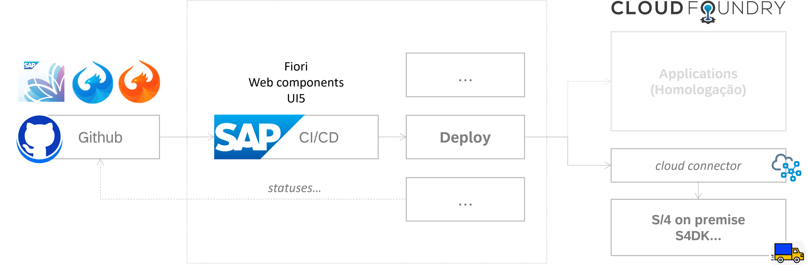

# Entrega de aplicativo Fiori para o sistema S/4 (on-premise)

- [Entrega de aplicativo Fiori para o sistema S/4 (on-premise)](#entrega-de-aplicativo-fiori-para-o-sistema-s4-on-premise)
    - [Visão geral](#visão-geral)
    - [Subaccount e serviços de plataforma no SAP BTP](#subaccount-e-serviços-de-plataforma-no-sap-btp)
    - [Estratégia](#estratégia)
    - [**Habilitando o CI/CD em Apps Fiori**](#habilitando-o-cicd-em-apps-fiori)
    - [Referências](#referências)

### Visão geral

O [SAP Continuous Integration and Delivery](https://help.sap.com/docs/continuous-integration-and-delivery?locale=en-US) permite configurar e executar pipelines predefinidos de integração e entrega contínua (CI/CD) que criam, testam e implantam automaticamente alterações de código e aceleraram os ciclos de desenvolvimento e entrega.

1. **Visibilidade e rastreabilidade_:** Visibilidade em tempo real do status do processo de entrega.
2. **Eficiência e produtividade:** Automação de  tarefas repetitivas e simplificação do processo de entrega
3. **Padronização e consistência:** Garantia que todos os aplicativos são entregues de maneira uniforme e confiável.
4. **Garantia de qualidade:** Uso de testes automatizados (unitários e integrados), viabilizando a qualidade das aplicações antes mesmo de sua implantaçao, reduzindo o risco de bugs e falhas.
5. **Automação de processos:** Redução da necessidade de intervenção manual

> ℹ️ Documentação do produto em [**SAP Help Portal - SAP Continuous Integration and Delivery**](https://help.sap.com/docs/continuous-integration-and-delivery?locale=en-US)

### Subaccount e serviços de plataforma no SAP BTP

Abaixo são descritos a subaccount e serviço de plataforma utilizado.

- Subaccount 
  - Continuous Integration and Delivery https://amer.cockpit.btp.cloud.sap/cockpit#/globalaccount/CA6136636TID000000000741096186/subaccount/c0fa2d5a-5f26-4daf-999d-1b0d36701d5b/subaccountoverview
- Serviço
  - Continuous Integration and Delivery https://continuous-integration-and-delivery.cicd.cfapps.eu10.hana.ondemand.com

### Estratégia

- Novos aplicativos devem conter a configuração de integração e entrega contínuas (CI/CD) desde o **início do desenvolvimento**
- Durante manutenções em aplicativos existentes, a configuração de CI/CD deve ser implementada e levada em consideração a partir deste momento.
  - Importe o projeto no [Business Application Studio](https://applications-homologacao.br10cf.applicationstudio.cloud.sap) ou [VSCode](https://visualstudio.microsoft.com/), e realize a migração do projeto para UI5 tooling através da opçao "Migrate Projects for use in Fiori tools". 
  
> ℹ️ Ver blog [Migrate SAP Fiori projects from SAP Web IDE to SAP Business Application Studio](https://community.sap.com/t5/technology-blogs-by-sap/migrate-sap-fiori-projects-from-sap-web-ide-to-sap-business-application/ba-p/13544987)

### **Habilitando o CI/CD em Apps Fiori**

- Configuração `app`:
  1. Copiar todo o conteúdo da pasta [artefacts/.pipeline](artefacts/.pipeline), e adicionar na raiz do projeto.
  2. Atualizar o arquivo `.pipeline/config.yml`, e ajustar as propriedades abaixo:
     - `abapPackage`
     - `applicationName`
     - `transportRequestId`
  3. Atualizar o arquivo `transportRequestID` e incluir o número da solicitação de transporte na qual os ajustes serão gravados.

- Configuração `cloud`:
  - **Entrar em contato com a equipe de QA**

> ℹ️ ATENÇÃO: O repositório no GitHub deve estar previamente criado antes do desenvolvimento.   _Entre em contato com a equipe de QA para a criação do repositório._

### Referências

- [SAP Continuous Integration and Delivery](https://help.sap.com/docs/continuous-integration-and-delivery?locale=en-US)
- [Migrate SAP Fiori projects from SAP Web IDE to SAP Business Application Studio](https://community.sap.com/t5/technology-blogs-by-sap/migrate-sap-fiori-projects-from-sap-web-ide-to-sap-business-application/ba-p/13544987)